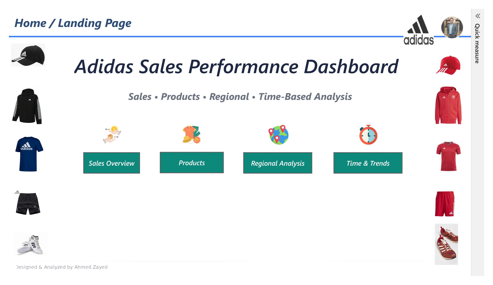
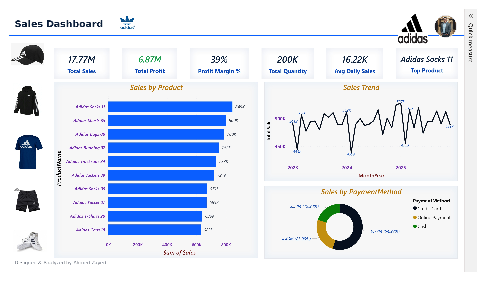
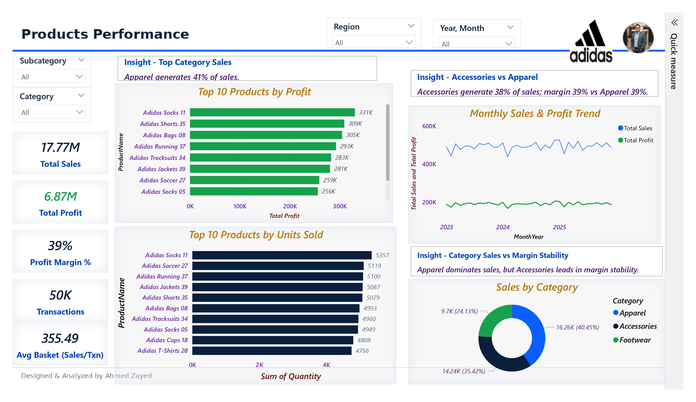
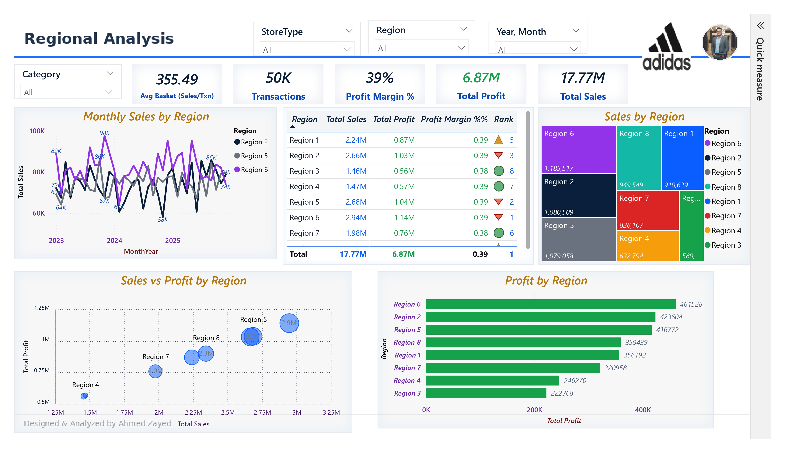
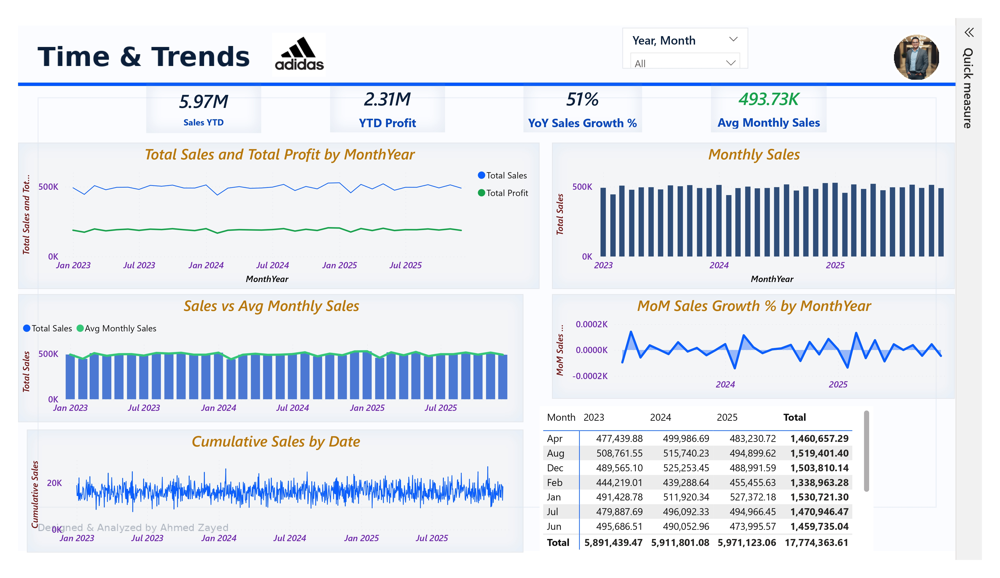

# Adidas Sales Performance Dashboard (Power BI)

Interactive Power BI dashboard analyzing Adidas sales performance across products, regions, and time.

## 📌 Project Objective
Build an executive-style dashboard to:
- Track sales, profit, and profitability (margin)
- Identify top products and category drivers
- Compare regions and store performance
- Monitor time trends (MoM, YoY, YTD)

## 🧩 Pages
1) **Home / Landing Page**: Navigation & overview
2) **Sales Overview**: KPIs + top products + payment mix + sales trend
3) **Products Performance**: Top products by sales/profit/units + category insights
4) **Regional Analysis**: Region performance + profit vs sales scatter + treemap
5) **Time & Trends**: YTD, YoY, MoM, cumulative sales, monthly patterns

## 📷 Dashboard Screenshots
> If images do not appear on GitHub, ensure the paths and filenames match exactly.

### Home / Landing Page

### Sales Overview

### Products Performance

### Regional Analysis

### Time & Trends

## 📊 Key KPIs
- Total Sales
- Total Profit
- Profit Margin %
- Total Quantity (Units Sold)
- Transactions
- Avg Basket (Sales/Txn)
- Avg Monthly Sales
- Sales YTD, YTD Profit
- YoY Sales Growth %

## ✅ Strengths
- Consistent branding and layout across pages
- Clean KPI hierarchy and readability
- Insight cards + tooltips for storytelling
- Scalable design for adding more pages/metrics

## ⚠️ Limitations
- Dataset is synthetic/demo (not official Adidas data)
- Some visuals may require additional drillthrough pages for deeper analysis

## 💡 Recommendations
- Expand decomposition tree (Category → Subcategory → Product)
- Add a Waterfall chart for YoY/MoM change drivers
- Add rank movement (Ribbon chart) for product ranking over time
- Add slicer panel toggle (bookmarks) for cleaner UX

## 🛠 Tools
- Power BI Desktop
- DAX
- Data modeling (Star schema)
- Custom theme + page backgrounds

## 👤 Author
**Ahmed Zayed**  
Designed & Analyzed by Ahmed Zayed
